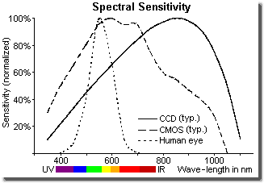
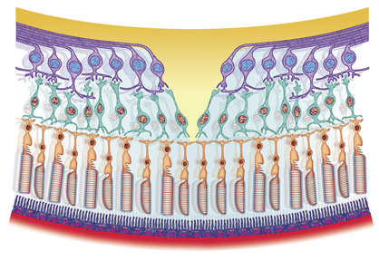
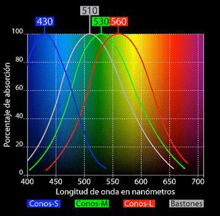
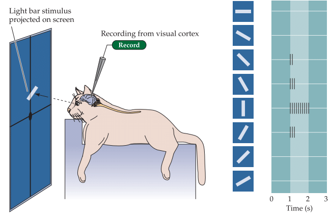
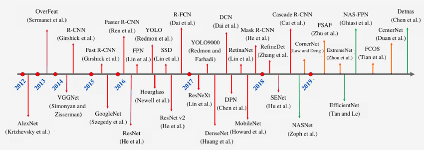
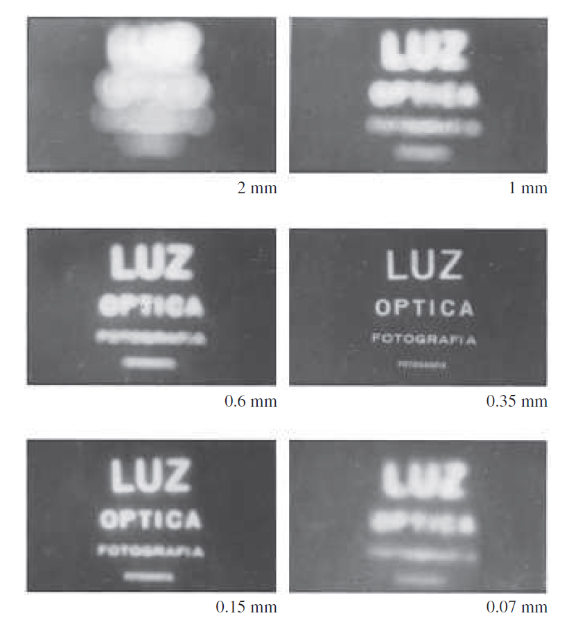
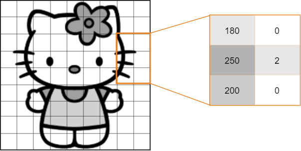
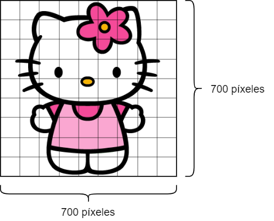

<!-- _class: titlepage -->

# Visión artificial

## Robótica

### Guillermo Iglesias Hernández y Alberto Díaz Álvarez

#### Departamento de Sistemas Informáticos - Universidad Politécnica de Madrid

##### 18 de septiembre de 2023

---

# La visión física y biológica<!-- _class: section -->

---

# ¿Qué es la visión?

Capacidad de captar el entorno a través de la _captación_ de _rayos de luz_

- Sentido casi esencial para la relación entre ser humano y su entorno
- Tanto es así que se estima que al menos **un tercio** del cerebro se dedica a procesar el sentido de la vista
- El procesamiento cerebral de la información visual juega un papel _crucial_ en la tarea de la visión.

---

# El espectro electromagnético visible (I)

El ser humano solo es _capaz_ de ver las longitudes de onda entre _380 y 750 nm_

<figure class="image">
  
  <figcaption><b>Fig. 2.1</b> - Espectro visible por el ojo humano. Fuente: [1]</figcaption>
</figure>

Esto es gracias a su mecanismo de captura de luz, pero **no es el único**

---

# El espectro electromagnético visible (y II)

Ejemplo: El **sensor digital** de una cámara fotográfica puede _capturar frecuencias fuera del espectro visible_ (especialmente en el rango infrarrojo

<figure class="image">
  

  
  <figcaption><b>Fig. 2.2</b> - Sensibilidad a diferentes frecuencias de luz dependiendo del sensor que las captura. Fuente: [2]</figcaption>
  

</figure>

---

# La visión en el ser humano

El ojo **procesa** la luz a través de células sensibles a este espectro electromagnético

  
## Conos

- Visión de **alta intensidad** (diurna)
- Tres tipos: L, M y S1

## Bastones

- Visión de **baja intensidad** (nocturna)
- Mayor cantidad que los conos

<figure class="image">
  

  
  <figcaption><b>Fig. 2.3</b> - Fragmento de la retina. Fuente: [3]</figcaption>
  

</figure>

> 1 Su ausencia o mal funcionamiento llevan a problemas de percepción de colores como la protanopía (L), deuteranopía (M), tritanopía (S) o acromatopsia (L, M y S)

---

# Rango del color percibido

**No todos** los colores se captan con la misma **intensidad**.

<figure class="image">
  

  
  <figcaption><b>Fig. 2.4</b> - Longitudes de onda capturadas por cada tipo de célula fotosensible del ojo. Fuente: [6]</figcaption>
  

</figure>

---

# La visión neuronal<!-- _class: section-->

---

# El cerebro en la visión

Tras captar la luz, **el cerebro da sentido a los estímulos** capturados por el ojo

- El _hardware_ se encarga de _captar la señal_ y el _software_ la _procesa adecuadamente_

<figure class="image">
  

  pipeline</i> de menor a mayor complejidad">
  <figcaption><b>Fig. 2.5</b> - La información visual se procesa en un <i>pipeline</i> de menor a mayor complejidad. Fuente: [9]</figcaption>
  

</figure>

La **corteza visual primaria** es la **primera capa que procesa** la información visual

- Trabaja con formas sencillas, dando información procesada a capas superiores
- Según avanza en el procesamiento, se reconocen formas más complejas

---

# Introducción a la visión por computador<!-- _class: section -->

---

# ¿Qué es la visión por computador?

Rama de la inteligencia artificial encargada del procesamiento de imagen digital

- No dejan de producirse grandes avances gracias a la mejora en la técnica
- Las redes neuronales tienen **mucho** (en realidad **todo**) que ver

<figure class="image">
  

  
  <figcaption><b>Fig. 2.6</b> - Evolución del campo de la visión por computador durante los últimos años. Fuente: [11]</figcaption>
  

</figure>

---

# Algunas de sus aplicaciones

- **Clasificación** de imágenes
- **Deteción** y **reconocimiento** de objetos
- **Segmentación** de objetos
- **Generación** de imágenes
- **Domain-to-domain translation**
- **Text-to-image translation**
- **Superresolution**

---

# Captura de imagen tradicional<!-- _class: section -->

---

# De la necesidad de capturar el mundo

La tecnología ha permitido capturar el mundo de formas cada vez más precisas

- Una de estas formas ha sido **simular** el sentido de **la vista**

Leonardo da Vinci fue el precursor en capturar imágenes a través de la **proyección de la luz**

- Éste y otros permitían **capturar** parte de la realidad, pero _**no su digitalización**_

<figure>
  

  
  <figcaption align="center">
  
  **Fig.1** - _Camera Obscura_. Fuente: [Wikimedia Commons](https://commons.wikimedia.org/wiki/File:Camera_obscura.jpg)

  </figcaption>
  

</figure>

---

# La cámara <i>pinhole</i> (I)

El modelo de cámara _pinhole_ permite la formación de imágenes a través
del paso por una abertura _minúscula_ de la luz, proyectándose sobre un
plano de imagen.

<figcaption align="center">

**Fig.1** - Esquema de cámara tipo <i>pinhole</i>. Fuente: [Wikimedia Commons](https://commons.wikimedia.org/wiki/File:Pinhole-camera.png)

</figcaption>

Los objetos capturados _se invierten_  respecto su posición real

---

# La cámara <i>pinhole</i> (II)

La principal desventaja tiene que ver justo con la abertura por la que pasa la luz:

1. Si es demasiado **grande**, la imagen se **difumina**
2. Si es demasiado **pequeña**, se producen **difracciones**

De los intentos de evitar esta difuminación nace el campo de la **óptica**

<figure>
  

  
  <figcaption align="center">
  
  **Fig.1** - Diferentes aperturas. Fuente: Ni idea.

  </figcaption>
  

</figure>

Friknota: Mr. Pinhole ([http://www.mrpinhole.com/calcpinh.php](http://www.mrpinhole.com/calcpinh.php))

---

# Modelo de lente fina

Las lentes son el principal logro de la óptica. Éstas permiten:

- Aumentar el tamaño de la apertura de la cámara
- Disminuir el desenfoque producido
- **Orientar** los rayos de luz
- **Corregir** las aberraciones producidas por otras lentes

<figcaption align="center">

**Fig.1** - Diagrama de rayos de una lente convexa. Fuente: [FisicaLab](https://www.fisicalab.com/apartado/lentes-delgadas)

</figcaption>

---

# Calibración en una cámara

Las diferentes lentes de una cámara producen **distorsiones** en la imagen

- También se denominan **aberraciones** y son inevitables

La **calibración** es un proceso que permite **corregir** estas distorsiones

- Se realiza a través de **algoritmos** que permiten **rectificar** la imagen
- Forma parte del campo de la **visión por computador**

<figcaption align="center">

**Fig.1** - Aberración de tipo esférica. Antes y después de aplicar el algoritmo [COSTAR](https://es.wikipedia.org/wiki/%C3%93ptica_Correctiva_de_Sustituci%C3%B3n_Axial_del_Telescopio_Espacial). Fuente: [Revista Astronomía](https://www.globalastronomia.com/aberraciones-opticas/).

</figcaption>

---

# La cámara digital

Dispositivo que permite capturar imágenes a través de un sensor digital

- Suelen contener un sensor con miles (millones) de receptores de intensidad de luz
- Dos tipos principales, dependiendo de cómo se convierte de fotón a electrón:
  - **CCD** (_Charge-Coupled Device_): A través de un chip externo al sensor
  - **CMOS** (_Complementary Metal-Oxide Semiconductor_): En el propio sensor

<figcaption align="center">

**Fig.1** - Diferencia entre sensor CCD y sensor CMOS. Fuente: [Tech Briefs](https://www.techbriefs.com/component/content/article/tb/pub/features/articles/23094).

</figcaption>

> [The ultimate image sensor guide: EMCCD vs. SCMOS vs. CMOS vs. CCD](https://www.e-consystems.com/blog/camera/technology/the-ultimate-image-sensor-guide-emccd-vs-scmos-vs-cmos-vs-ccd/)

---

# ¿Y cómo se capturar color?

Capturar sólo niveles de luz **no nos permite diferenciar colores**

Para la captura de colores existen principalmente dos soluciones:

## Triple CCD

- Un prisma divide la luz en tres haces
- Cada haz a un sensor digital distinto

<figcaption align="center">

**Fig.1** - Esquema de Triple CCD. Fuente: [Wikipedia](https://en.wikipedia.org/wiki/Three-CCD_camera#/media/File:Dichroic-prism.svg).

</figcaption>

## Mosaico de Bayer

- Un filtro en cada receptor de luz
- 50% verdes, 25% rojos y 25% azules

<figcaption align="center">

**Fig.1** - Representación de un Mosaico de Bayer. Fuente: [Wikipedia](https://es.wikipedia.org/wiki/Mosaico_de_Bayer#/media/Archivo:Bayer_pattern_on_sensor.svg).

</figcaption>

---

# Limitados al rango de luz visible

Los sensores están limitados para capturar **lo que ve el ojo humano**

<figcaption align="center">

**Fig.1** - Esquema estándar de sensibilidad de la cámara. Fuente: [IR Photo](https://www.ir-photo.net/ir_imaging.html).

</figcaption>

El rango _infrarrojo_ se bloquea a través del uso de _filtros_

- Estos impiden que ciertas frecuencias atraviesen la lente y lleguen al sensor

---

# Imagen digital<!-- _class: section -->

---

# ¿Qué es una imagen digital?

Tras conocer cómo se captura una escena de la realidad y esta es digitalizada, ahora es vital conocer en profundidad las características de las imágenes digitales.

<figcaption align="center">

**Fig.1** - Ejemplo de una imagen digital.

</figcaption>

Una imagen digital está formada por _píxeles_, los cuales corresponden con la intensidad de color para cierto punto de la imagen

---

# Elementos de una imagen digital

Una imagen digital se compone de píxeles, sin embargo existen distintas características que definen a dicha imagen:

- Tamaño de la imagen
- Número de canales
- Codificación de los canales
- Profundidad de color

---

# Tamaño de la imagen

El tamaño de la imagen o _resolución_ corresponde con el _número de píxeles_ que forman dicha imagen.

- Dependiendo de la imagen, su dimensión o _relación de aspecto_ puede variar

<figcaption align="center">

**Fig.1** - Tamaño de una imagen digital

</figcaption>

---

# Canales

Conjunto de píxeles que definen la _intensidad para cierto rango de frecuencias_ de una imagen

- Los distintos canales de una imagen se _combinan_ para formar la imagen final
- Dependiendo del **tipo de codificación**, el **número** y **configuración** de canales puede variar

<figcaption align="center">

**Fig.1** - Diferentes canales de una imagen que conforman la imagen final

</figcaption>

---

# Profundidad de color

La información de cada píxel _debe estar normalizada_ en un rango de valores

- Éste indica la _precisión_ a la cual fue capturada la intensidad de luz en ese punto

La **profundidad de color** indica cuánta intensidad de luz representa el valor de cada píxel

---

# La imagen en la informática

A la hora de programar, una imagen se representa con una _matriz numérica_ de valores, en la que cada posición corresponde a un _píxel_

- A través de bibliotecas como numpy se pueden realizar transformaciones en la composición de las imágenes

<figcaption align="center">

</figcaption>

Ejercicio: [Imagen_Digital.ipynb](https://colab.research.google.com/drive/1k2vqQOiMMxOSOsZqHdhZ1Z-eblhtvvVV?usp=drive_link)1

> <https://colab.research.google.com/drive/1k2vqQOiMMxOSOsZqHdhZ1Z-eblhtvvVV?usp=drive_link>

---

# ¡GRACIAS!<!--_class: endpage-->
